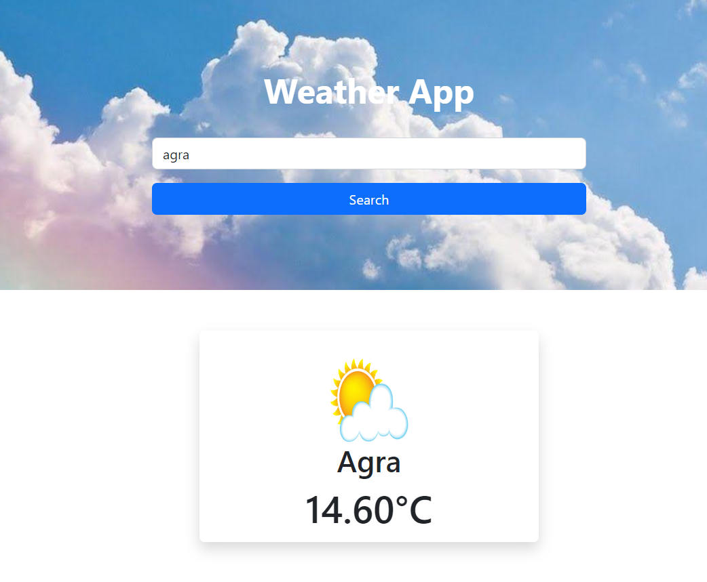

# Weather App

An interactive weather application built with React.js that allows users to check the current weather 

## Overview

The Weather App is a React.js application that provides users with real-time weather information.

## Features

- **Current Weather:** Display the current temperature.

## Demo

Include a link or GIF demonstrating the functionality of your Weather App.


## Getting Started

Follow these instructions to set up the project locally on your machine.

### Prerequisites

- Node.js and npm should be installed on your machine.

### Installation

1. Clone the repository:

   ```bash
   git clone https://github.com/nandinikashyap1902/Weather_WebApp.git

### Technologies Used
.React.js
.HTML5
.CSS3
.JavaScript

### Contributing
Feel free to contribute to this project. Follow the guidelines in CONTRIBUTING.md.